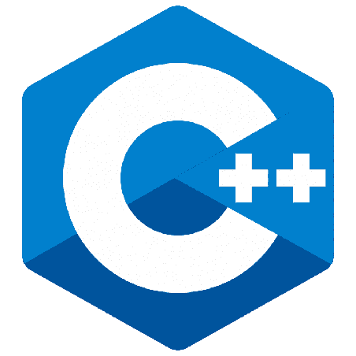

### Hi there 👋

Programmer, Web Developer and Cyber Security enthusiast. 😄

- 🌱 I am currently making advancements in cybersecurity and web development.
- 🔭 Looking for some intership's and open source projects.
- 📫 How to reach me: 

  &nbsp;&nbsp;&nbsp;&nbsp;
  &nbsp;&nbsp;&nbsp;&nbsp;
  

- 📘Languages and Teachnologis
  - Python
  - C/C++
  - JavaScript
  - Node.js
  - React.js
  - Redux
  - MongoDb
  - SQL/NoSQL
  - Django
  - Flask
  - REST API

&nbsp;&nbsp;&nbsp;
&nbsp;&nbsp;&nbsp;
&nbsp;&nbsp;&nbsp;
&nbsp;&nbsp;&nbsp;
&nbsp;&nbsp;&nbsp;

## Thank for visiting 🙂
